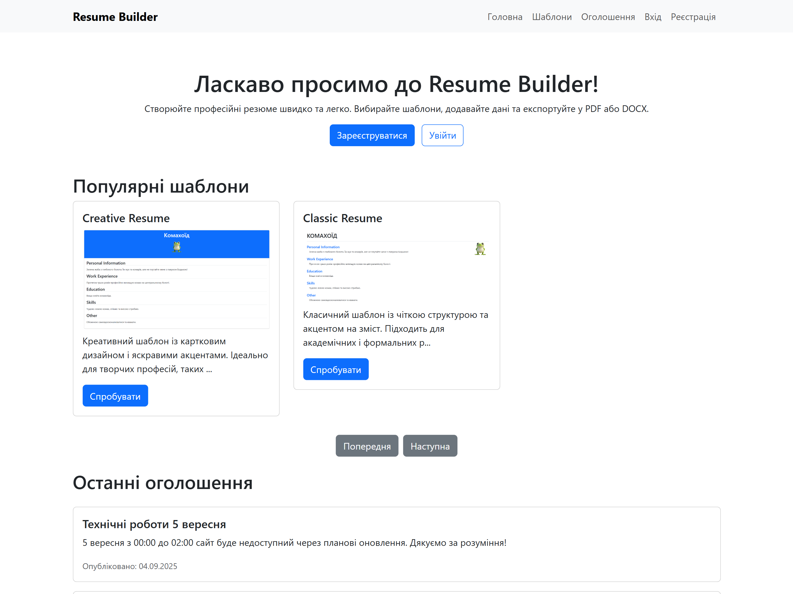
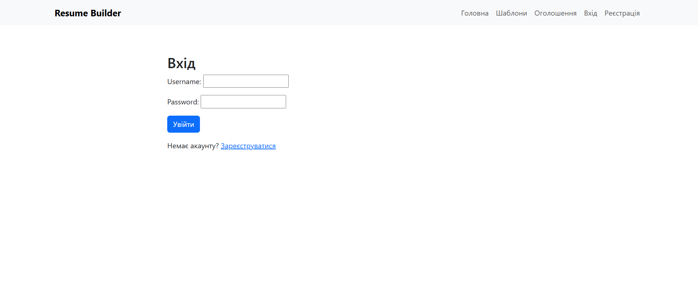
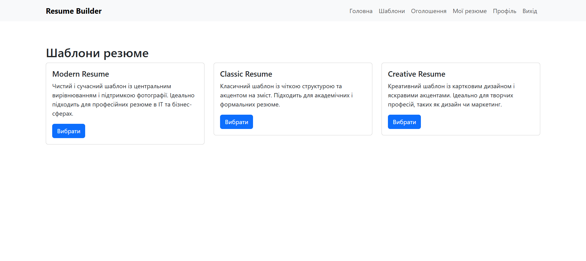
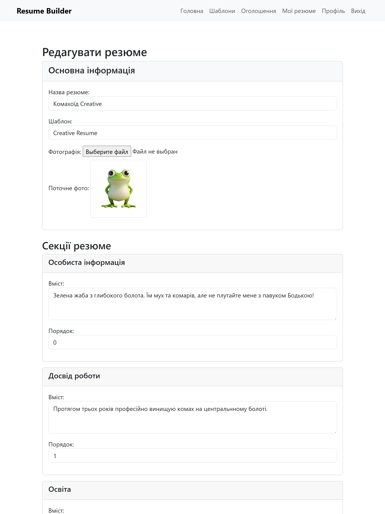
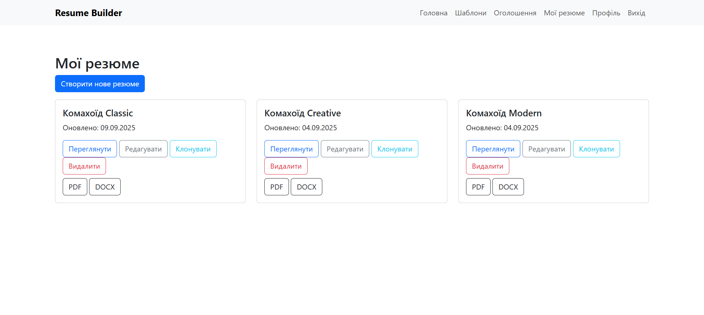
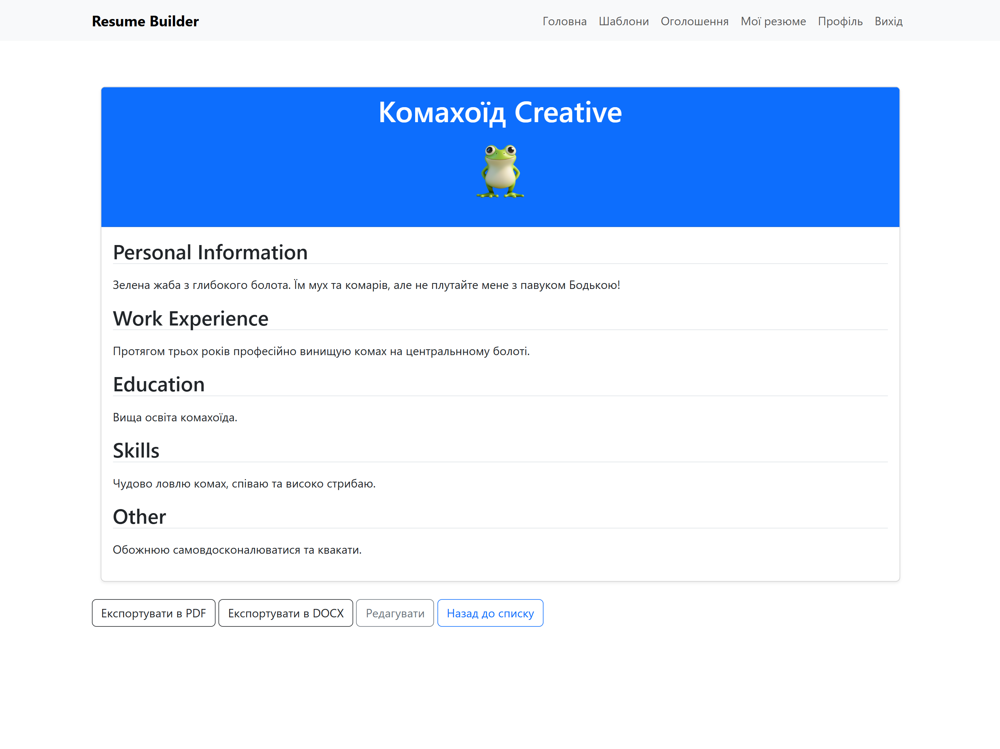
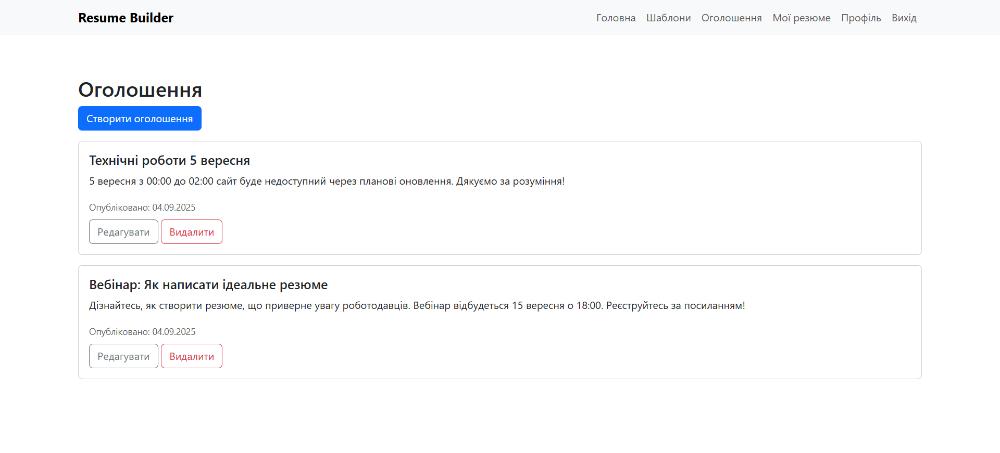
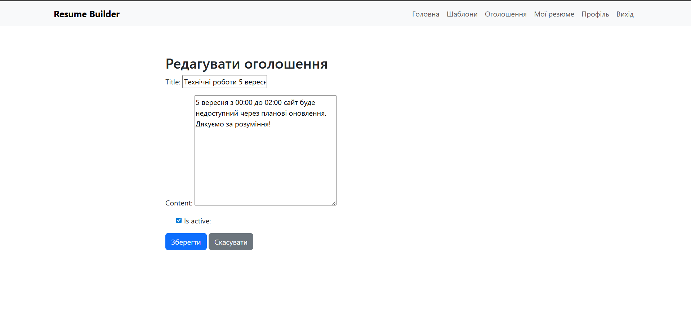
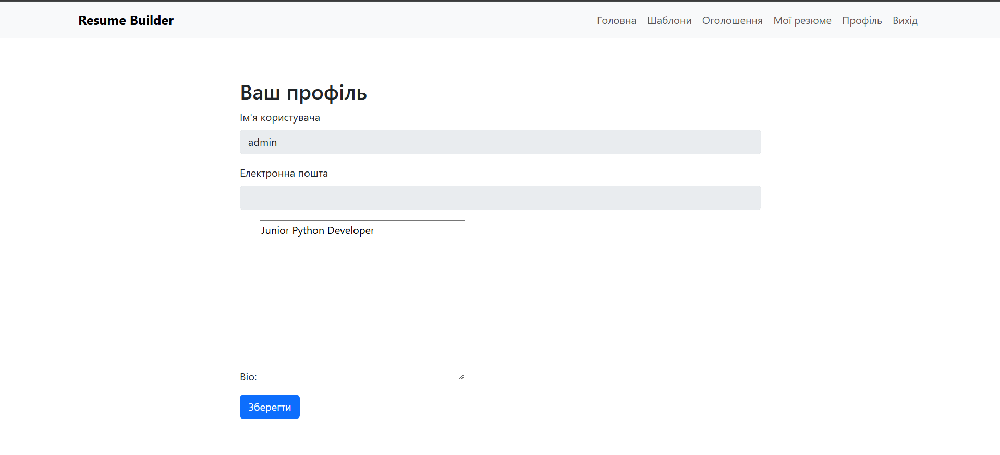

# Resume Builder

Resume Builder is a Django-based web application for creating, editing, and exporting professional resumes. It allows users to choose from predefined templates, fill in sections like personal information, work experience, education, skills, and more. The application also includes user authentication, profile management, announcements, and API endpoints for data access.

## Features

- User registration and login.
- Profile management with bio.
- Resume creation and editing with multiple sections (personal, experience, education, skills, other).
- Resume templates with HTML rendering for preview and export.
- Export resumes to PDF and DOCX formats.
- Announcement system for admins to post updates.
- AJAX pagination for popular templates on the home page.
- REST API for all models (Profile, ResumeTemplate, Resume, ResumeSection, Announcement).
- Unit tests for models, forms, views, and serializers.
- Docker support for easy deployment.

## Installation

### Prerequisites
- Python 3.12+
- PostgreSQL (or SQLite for development)
- Docker (optional for containerization)

### Local Setup
1. Clone the repository:
   ```bash
   git clone <repository_url>
   cd resume_builder
   ```

2. Create and activate a virtual environment:
   ```bash
   python -m venv env
   source env/bin/activate  # On Windows: env\Scripts\activate
   ```

3. Install dependencies:
   ```bash
   pip install -r requirements.txt
   ```

4. Set up environment variables (use `.env` file or export):
   ```
   SECRET_KEY=your_secret_key
   DEBUG=True
   DB_NAME=your_db_name
   DB_USER=your_db_user
   DB_PASSWORD=your_db_password
   DB_HOST=localhost
   DB_PORT=5432
   ```

5. Apply migrations and create superuser:
   ```bash
   python manage.py migrate
   python manage.py createsuperuser
   ```

6. Run the server:
   ```bash
   python manage.py runserver
   ```

Access the app at `http://127.0.0.1:8000/`.

### Docker Setup
1. Build the Docker image:
   ```bash
   docker build -t resume-builder .
   ```

2. Run the container:
   ```bash
   docker run -p 8000:8000 -e SECRET_KEY=your_secret_key -e DEBUG=True resume-builder
   ```

Access the app at `http://127.0.0.1:8000/`.

## Usage

1. **Registration and Login**: New users can register and log in to access features.
2. **Create Resume**: Go to `/resume/create/` to create a new resume, select a template, upload a photo, and fill in sections.
3. **Edit Resume**: Edit existing resumes at `/resume/<id>/edit/`.
4. **Preview and Export**: Preview at `/resume/<id>/preview/` and export to PDF or DOCX.
5. **Announcements**: Admins can create announcements at `/announcement/create/`.
6. **Templates**: View templates at `/templates/`, with AJAX pagination on the home page.
7. **API**: Access API endpoints like `/api/resumes/` for CRUD operations.

## API Endpoints

The app provides REST API using Django Rest Framework:

- `/api/profiles/`: List/create profiles.
- `/api/profile/<pk>/`: Retrieve/update/delete profile.
- `/api/resume-templates/`: List/create resume templates.
- `/api/resume-template/<pk>/`: Retrieve/update/delete resume template.
- `/api/resumes/`: List/create resumes.
- `/api/resume/<pk>/`: Retrieve/update/delete resume.
- `/api/resume-sections/`: List/create resume sections.
- `/api/resume-section/<pk>/`: Retrieve/update/delete resume section.
- `/api/announcements/`: List/create announcements.
- `/api/announcement/<pk>/`: Retrieve/update/delete announcement.

Use tools like Postman or curl for testing.

## Testing

Run unit tests with:
```bash
python manage.py test core
```

Tests cover models, forms, views, and serializers.

## Deployment

For production:
1. Set `DEBUG = False` in `.env`.
2. Configure PostgreSQL database.
3. Run `python manage.py collectstatic`.
4. Use Gunicorn/Nginx for serving.

## Screenshots

### Homepage


### Login Page


### Resume Template List Page


### Resume Create\Edit Page


### User Resumes Page


### Resume Preview Page


### Announcements Page


### Announcements Delete\Create Page


### Profile Page


